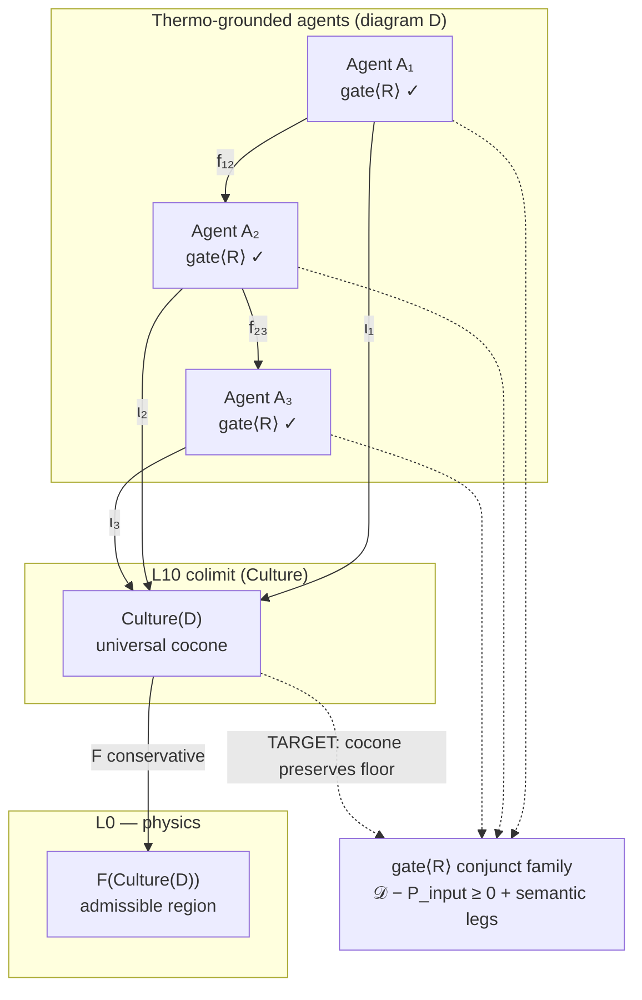

SPDX-FileCopyrightText: 2026 Santosh Prabhu Shenbagamoorthy and Santhosh Shyamsundar
SPDX-License-Identifier: MIT
# L10 Colimit Thermo Gate — Unproven Extension Register

| Field | Value |
|-------|-------|
| **When** | 2026-07-19 11:54 IST |
| **Job** | F25-M6-05 · M6 L10 research deepen |
| **Authority** | [`BLUEPRINT_STEELMAN_RESEARCH.md`](../../../docs/BLUEPRINT_STEELMAN_RESEARCH.md) VIII.4 · [`CARTRIDGE_REORG_BLUEPRINT.md`](../../../docs/CARTRIDGE_REORG_BLUEPRINT.md) §17.7 · [`M6_L10_LITERATURE_1048.md`](../../../old/residuals/residuals/misc-outputs-tmp/m6_prep/M6_L10_LITERATURE_1048.md) |
| **Prior deepen** | W3M-28 round 2 · M6-PREP-R4 |
| **Status** | **RESEARCH ONLY** — extension labeled **unproven**; no Lean colimit module; no `gate<SemanticResponse>` production |
| **Lean index** | `P6OpenObligation.colimit_universal_floor` · `functor_F_conservative` in [`CoordinationCostP6.lean`](../Lean/CoordinationCostP6.lean) |
| **Spine crosswalk** | [`COORDINATION_COST_P6_SPINE.md`](COORDINATION_COST_P6_SPINE.md) |

---

## 1. Executive summary

Steelman **VIII.4** and blueprint **§17.7** model **Culture (L10)** as a **colimit** over thermodynamically grounded agents, with a conservative functor **`F: L10 → L0`**. Goguen conceptual blending supplies the **established** categorical precedent (pushout / colimit over input spaces). UMST's **novel extension** — the subject of this register — is a **thermodynamic admissibility gate on the colimit diagram**: only agent legs that pass `gate<R>` (material + informational + semantic conjuncts) may participate in the universal cocone, and the cocone's universal property must **preserve** the A7 coordination Landauer floor.

**Culture honesty (binding):** Goguen explains **concept invention** (blending new ideas from partial overlaps). L10 targets **shared culture** as the universal cocone over **admissible** agent diagrams. The thermo gate on that diagram is **not** established in prior art — it is a **designed extension** awaiting P6 construction and proof. Do not conflate Goguen precedent with a proved UMST colimit.

---

## 2. Established vs UMST extension

| Layer | Source | What it gives | UMST status |
|-------|--------|---------------|-------------|
| **Pushout / colimit blending** | Goguen [AI Review 2019](https://doi.org/10.1007/s10472-019-09654-6) | Concept invention via colimit over input conceptual spaces | **Precedent** — cited at P6; not UMST-specific proof |
| **3/2-pushouts** | Goguen selective projection | Flexible blending when standard colimit is too rigid | **Precedent** — UMST must document **which agents glue** |
| **Amalgam uniform model** | Kutz et al. — amalgam ≅ pushout in ordered partial maps | Computable blending over partial overlaps | **Precedent** — no thermo constraint |
| **Lang ⊣ Syn** | Categorical logic | Syntax ↔ semantics adjunction | **Established** formal backbone for language functors |
| **Thermo-grounded diagram** | UMST §17.7 · VIII.4 | Diagram objects = agents with `gate<R>`-admissible state transitions | **Designed** — **unproven** |
| **Thermo gate on colimit** | UMST VIII.4 extension | Universal cocone leg must satisfy `𝒟 − P_input ≥ 0` + semantic conjuncts | **Designed** — **unproven** |
| **Landauer in universal property** | UMST VIII.4 · VIII.5 | `understanding_cost` / `mi_deficit` enter colimit leg accounting | **Hypothesis** — P3 calibration blocked |
| **Conservative `F: L10 → L0`** | UMST §17.7 · W4 joint gate | Every semantic claim has L0 admissibility preimage | **Designed** — W4 enforced at gate; formal proof **OPEN** |

---

## 3. Diagram schema (research — not compiled)

### 3.1 Agent diagram (indexed category)

```text
Agents Aᵢ  — each carries:
  • MeaningStateᵢ  (SDF / quotient memory)
  • SemanticResponseᵢ  (consistency_defect, mi_deficit, understanding_cost)
  • Admissibility witness  gate<R>(stateᵢ)  — must hold on every leg

Morphisms fᵢⱼ : Aᵢ → Aⱼ  — Kleisli arrows (propose → witness → admit)
  • Composition preserves gate conjuncts (monad law target — A7 Rust GREEN, Lean import OPEN)
  • Cross-agent alignment: natural transformation on quotient_id (not embedding distance)
```

**Thermo gate (unproven extension):** an agent **does not appear** in the culture diagram unless every observable leg in its local diagram has passed `gate<R>`. This is stronger than Goguen, where input spaces need not be physically grounded.

### 3.2 Colimit universal property (target statement — NOT proved)

```text
Let D : J → L10 be a diagram of thermo-grounded agents.
Assume:
  (T1) ∀ i,  gate<R>(D(i)) admissible on all legs used in D
  (T2) ∀ f : i → j in J,  D(f) preserves quotient_id + gate conjuncts

Culture(D) := colim D   (universal cocone (ιᵢ : D(i) → Culture(D)))

TARGET (unproven):
  (U1) ∀ i,  coordinationSavingJoules(Culture(D)) ≤ coordinationSavingJoules(D(i))  [floor preservation — dual to "cocone leg"]
  (U2) ∀ cocone (cᵢ), ∃! mediating map u : Culture(D) → C  s.t. cᵢ = u ∘ ιᵢ
      AND  gate<R>(u) admissible
  (U3) F(Culture(D)) admits L0 preimage (conservative F)
```

**Honest label:** (U1) is indexed as `colimit_universal_floor` in `CoordinationCostP6.lean`. (U2)–(U3) are `functor_F_conservative` and joint-gate obligations — **none discharged**.

### 3.3 Mermaid — culture cocone over gated agents



---

## 4. What the thermo gate adds beyond Goguen

| Goguen blending | UMST L10 thermo extension |
|-----------------|---------------------------|
| Input spaces are conceptual / geometric | Input agents must be **gate-admissible** dynamical systems |
| Colimit selects shared structure | Colimit selects **shared admissible meaning** with **byte_equal** quotient witness |
| No energy accounting | **A7 floor** must be preserved across cocone legs (`coordination_saving_joules`) |
| No physics reduction | **`F: L10 → L0`** — semantic culture must map to fabricable L0 region |
| Concept **invention** | Shared **culture** — smallest story agents agree on without breaking gate |
| Blending can be partial (3/2-pushout) | Partial overlap requires **explicit** alignment witness on `quotient_id` |

**Failure mode (from R4 §7.5):** if agents in the diagram are not thermo-grounded, the colimit **does not glue** — reject culture witness, do not patch with embedding.

---

## 5. Connection to `SemanticResponse` and A7

### 5.1 Per-agent leg (before colimit)

```text
dissipation()   :=  -consistency_defect
power_input()   :=  mi_weight * mi_deficit + understanding_weight * understanding_cost
net_dissipation :=  dissipation() - power_input()   // gate conjunct
```

Each agent leg in the diagram must satisfy `net_dissipation ≥ 0` (open-system: `𝒟 − P_input ≥ 0`).

### 5.2 Colimit leg (target — unproven)

The universal cocone should **aggregate** agent legs without **double-counting** MI across correlated agents:

| Concern | A7 anchor | Colimit honesty |
|---------|-----------|-----------------|
| Pairwise MI floor | `coordination_saving_joules` | Cocone must not claim savings **below** per-agent floors |
| n-ary global MI | `coordination_saving_global_joules` (A7-4) | Multi-agent diagram may need **global** witness, not pairwise sum |
| Epistemic vs physical MI | `PhysicalMiBridgeWitness` required | `mi_deficit` in colimit is **hypothesis** until P3 |
| `understanding_cost` | Landauer proxy (VIII.5) | **Hypothesis** — not auto-summed across agents |

**Bridge rule (from P6 spine):** `understanding_cost` may cite `coordinationSavingJoules` **only** with `PhysicalMiBridgeWitness`. Colimit aggregation inherits this — no epistemic auto-projection.

---

## 6. Proof obligation ladder (indexed — no `sorry`)

From [`CoordinationCostP6.lean`](../Lean/CoordinationCostP6.lean) `P6OpenObligation`:

| Obligation | Meaning | Blocked by |
|------------|---------|------------|
| `colimit_universal_floor` | L10 colimit cocone preserves coordination Landauer floor | L10 colimit construction module |
| `functor_F_conservative` | `F : L10 → L0` does not increase floor projection | Category scaffold + physics packaging |
| `mi_deficit_gate` | `mi_deficit` as `SemanticResponse` gate conjunct | A10 P2–P3 gate module |
| `understanding_cost_bounded` | `understanding_cost ≤ coordinationSavingJoules` on physical bridge | Epistemic→physical witness |
| `epistemic_mi_witness` | Semantic MI ≠ physical MI without bridge | P3 calibration |

**Proof strategy (ordered — from P6 spine, not executed):**

1. Freeze A7 `CoordinationCost.lean` (42 thm · 0 sorry) as cocone **floor** reference.
2. Define L10 diagram category (`AgentDiagram` / `ThermoGrounded`) in separate module — **not started**.
3. State colimit as **typed** universal property with gate conjunct on mediating maps.
4. Prove `colimit_universal_floor` as **inequality** on `coordinationSavingJoules` — not equality (agents may correlate).
5. Package `F` conservativity as **separate** lemma from Kleisli compose — do not conflate.

---

## 7. What we must NOT claim

1. **"Goguen proves UMST culture colimit"** — Goguen proves blending; thermo gate is UMST extension.
2. **"Colimit preserves wall-clock joules"** — only **Landauer floor** projection per A7 honesty string.
3. **"RLHF ≈ culture colimit"** — RLHF has no `gate<R>`, no `F: L10→L0`, no byte_equal witness.
4. **"Lean green ⇒ culture proved"** — `CoordinationCostP6.lean` is obligation index + draft types only.
5. **"Multi-agent MI sums freely"** — n-ary global floor (A7-4) may subsume pairwise; colimit accounting TBD.
6. **"Semantic pass lifts material fail"** — W4 joint gate rejects; conservative `F` is gate discipline, not colimit theorem.

---

## 8. Failure modes and diagnostics

| Symptom | Diagnosis | Response |
|---------|-----------|----------|
| Colimit does not glue | Agent not thermo-grounded in diagram | **Reject** culture witness |
| `F(shape)` not fabricable | Meaning outruns physics | **Reject** — conservative `F` working |
| Same word, different quotient ID | Wrong `L` functor or bad canonicalize | Fix cartridge |
| Different words, same ID | Expected many-to-one | Adjunction honesty — not bug |
| Cocone violates floor | Double-counted MI or missing bridge | Reject; fix aggregation witness |
| 3/2-pushout needed | Partial agent overlap | Document selective projection + alignment witness |

---

## 9. Build ladder placement

| Slice | Colimit relevance | Status |
|-------|-------------------|--------|
| **P0–P2** | Primitives + chair + `gate<SemanticResponse>` stub | IN PROGRESS / BLOCKED |
| **P3** | `mi_deficit` / `understanding_cost` calibration | **BLOCKED** (M6 gate) |
| **P4–P5** | Sanskrit functors · Chinese adversarial | **BLOCKED** |
| **P6** | L10 colimit construction + `F: L10→L0` formal program | **BLOCKED** — this register feeds P6 |

**W4-SEM-P6.1 done-when:** L10 colimit + conservative `F` — every semantic claim reducible to physics. **Not met.**

---

## 10. Cross-references

| Doc | Role |
|-----|------|
| [`M6_L10_LITERATURE_1048.md`](../../../old/residuals/residuals/misc-outputs-tmp/m6_prep/M6_L10_LITERATURE_1048.md) | R4 authority · VIII.4 cross-link |
| [`cell_W3M-28_l10_lit.md`](../../../old/residuals/residuals/misc-outputs-tmp/m6_cells/cell_W3M-28_l10_lit.md) | Round 2 literature deepen |
| [`COORDINATION_COST_P6_SPINE.md`](COORDINATION_COST_P6_SPINE.md) | A7 → P6 obligation map |
| [`M6_SEMANTICS_PREP_1043.md`](../../../old/residuals/residuals/misc-outputs-tmp/m6_prep/M6_SEMANTICS_PREP_1043.md) | §6.1 conservative `F` |
| [`wave4_embodied_schedule.md`](../../../old/residuals/residuals/misc-outputs-tmp/wave4_embodied_schedule.md) | W4-SEM-P6.1 |

---

## 11. Copy-ready messaging

> **Culture (L10)** is modeled as a colimit over **thermodynamically grounded** agents — a designed extension of Goguen conceptual blending. The **thermodynamic gate on the colimit diagram** (admissibility + Landauer floor preservation) is **unproven** and indexed as `P6OpenObligation`. Goguen explains concept invention; UMST targets shared culture as universal cocone over gate-admissible agent diagrams. No claim of proved colimit until P6 construction ships with discharged obligations.

---

*Register: `egoff/umst-formal/Docs/L10_COLIMIT_THERMO_GATE.md` · F25-M6-05 · research only · M6 binary **0** · no push*
